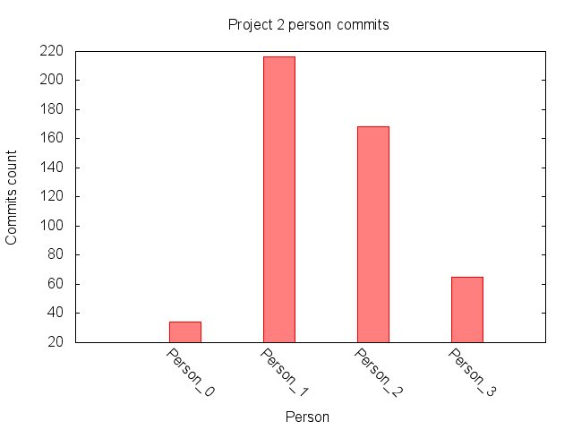
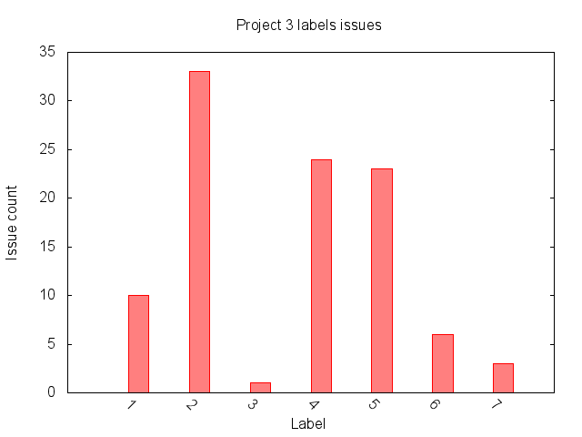
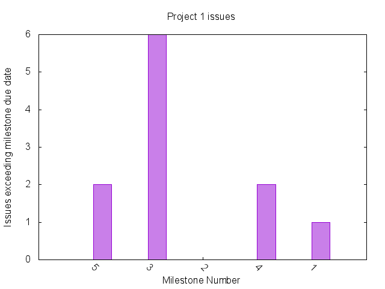

## Collection:
Data collection was done by using custom ruby scripts. We used Octokit, a ruby client for accessing the Github API. Octokit wraps the Github API in a flat API client that follows ruby conventions. 

Repository name and a project number(defined by us) are taken as arguments. Repository name is used to query the respective repository for the required features(attributes) using the methods provided by Octokit. Project Number is used to anonymize the csv file storing the extracted data.

### Commit Data Collection:
Commit data was extracted using the following Github API link:
https://api.github.com/repos/org_name/repo_name/commits (Octokit’s commit method internally utilises it),  The Octokit’s method extracts the commit data from the above mentioned Github API link and returns a list. This list consists of commit features such as the commit author, commit date etc., and were extracted by iterating through the list.

### Issue Data Collection:
Issue event data was extracted using the following Github API link:
https://api.github.com/repos/org_name/repo_name/issues/events (Octokit’s repository_issue_events() method internally utilises it),  The Octokit’s method extracts the issue data from the above mentioned Github API link and returns a list. This list consists of issue features such as the issue creation date, the corresponding label name etc., and were extracted by iterating through the list.
 
### Milestone Data Collection:
Milestone event data was extracted using the following Github API link:
https://api.github.com/repos/org_name/repo_name/milestones (Octokit’s list_milestones() method internally utilises it),  The Octokit’s method extracts the milestone data from the above mentioned Github API link and returns a list. This list consists of milestone features such as the milestone end date, milestone update date etc., and were extracted by iterating through the list.

## Anonymization
We have taken precautions so that no personal data gets added in the data file or the code files. While using the API we have avoided to fetch personal data if we didnt need it. Many feature extractors didn’t require use of personal information. In code we replaced the personal username with index of array ‘authors’, hence we could replace it with labels like Person_1, Person_2 and so on. 

## Tables:
In the data collection phase, data of desired features was collected from the Github API and was stored in a CSV file. Then in the data analysis phase, this data was then stored in a hashmap and statistical analysis was performed on this data. Statistical measures like the mean and standard deviation of the data set were extracted. Based on these measures, components showing anomalous behaviour were detected if their values exceeded the mean by more than 2 standard deviations. GNU plots were plotted for this data and bad smells (if any) were shown.

## Data:

### Features:

The values in the table represent the number of rows of data collected for that particular feature.

|Number|Feature|Project1|Project2|Project3|
|------|-------|--------|--------|--------|
|1|Uneven Commit History|121|510|182|
|2|Uneven Commits Per Person|117|483|168|
|3|Uneven Issues Per Label|201|120|107|
|4|Issues Exceeding Milestone Due Date|35|56|64|
|5|Unassigned Issues|38|67|80|
|6|Lack of Code Review|60|68|93|
|7|Issues Without Milestones|38|67|80|
|8|Uneven Label Time Distribution|396|427|433|
|9|Milestones Without Issues|5|5|5|
|10|Issues Without Description|38|67|80|

### Early warnings:

The values in the table represent the number of rows of data collected for that particular warning.

|Number|Feature|Project1|Project2|Project3|
|------|-------|--------|--------|--------|
|1|Milestone Deadline Exceed Warning|35|56|64|
|2|Passenger Warning|117|483|168|

## Data Samples:

### Features:

**1. Uneven Commit History**

Sample data table: 

| Commit Sha |date|  
|----------- |----|
|0734a1482f009b4c6c8dbe16e34daf3c75567373|2015-04-15 21:40:03 UTC|
|b71398d37c208a57e006753bcd6fd7ccee89357a|2015-04-15 20:25:37 UTC|

The links to the entire data set for this extractor can be found here
* [Project 1](features/uneven_commits/feature_results/project_1_commits.csv)
* [Project 2](features/uneven_commits/feature_results/project_2_commits.csv)
* [Project 3](features/uneven_commits/feature_results/project_3_commits.csv)

**2. Uneven Commits Per Person**

Sample data table: 

| commit sha |timestamp| anonymous username |
|-------------|----------|----------|
|0734a1482f009b4c6c8dbe16e34daf3c75567373|2015-04-15 21:40:03 UTC |Person_0|
|76d102926f51f882aefd8961a058c49538cd817c|2015-04-09 20:38:50 UTC |Person_1|

The links to the entire data set for this extractor can be found here
* [Project 1](features/uneven_person_commits/feature_results/project_1_person_commits.csv)
* [Project 2](features/uneven_person_commits/feature_results/project_2_person_commits.csv)
* [Project 3](features/uneven_person_commits/feature_results/project_3_person_commits.csv)

**3. Uneven Issues Per Label**

Sample data table: 

| issue number | event_created_at | action| label_name|
|------------- |------------------|-------|-----------|
|59|2015-04-05 19:12:41 UTC|labeled|Merged|
|13|2015-04-04 18:33:50 UTC|unlabeled|Awaiting Developer's Feedback|

The links to the entire data set for this extractor can be found here
* [Project 1](features/uneven_label_issues/feature_results/project_1_issues_labels.csv)
* [Project 2](features/uneven_label_issues/feature_results/project_2_issues_labels.csv)
* [Project 3](features/uneven_label_issues/feature_results/project_3_issues_labels.csv)

**4. Issues Exceeding Milestone Due Date**

Sample data table: 

| issue id | closed_at | milestone | due_on| exceed|
|------------- |-----------|----------------|-------|-------|
|66466828|2015-03-09 19:12:41 UTC| 1 |2015-03-05 19:12:41 UTC| yes|
|66351991|2015-03-05 18:33:50 UTC| 2 |2015-03-01 19:12:41 UTC| no |

The links to the entire data set for this extractor can be found here
* [Project 1](features/issues_exceeding_milestone_duedate/feature_results/project_1_issues.csv)
* [Project 2](features/issues_exceeding_milestone_duedate/feature_results/project_2_issues.csv)
* [Project 3](features/issues_exceeding_milestone_duedate/feature_results/project_3_issues.csv)

**5. Unassigned Issues (To Contributor)**

Sample data table: 

| issue number | issue title | assignee|
|------------- |-----------|----------------|
|59|Create a project report.|9207378|
|49|Create a project report skeleton.|9207378|

The links to the entire data set for this extractor can be found here
* [Project 1](features/unassigned_issues/feature_results/project_1_unassigned_issues.csv)
* [Project 2](features/unassigned_issues/feature_results/project_2_unassigned_issues.csv)
* [Project 3](features/unassigned_issues/feature_results/project_3_unassigned_issues.csv)

**6. Lack of Code Review**

Sample data table: 

| api_issue_number | issue/pull request title | user_id| issue or pull_request
|------------- |-----------|----------------|-----------|
|59|Create a project report.|9207378|issue|
|58|Update Report.|9207378|pull_request|

The links to the entire data set for this extractor can be found here
* [Project 1](features/code_review/feature_results/project_1_issues.csv)
* [Project 2](features/code_review/feature_results/project_2_issues.csv)
* [Project 3](features/code_review/feature_results/project_3_issues.csv)

**7. Issues Without Milestones**

Sample data table: 

| issue_id | milestone_number |smell|
|------------- |-----------|----------------|
|66466828|5|no|
|66351991|3|no|

The links to the entire data set for this extractor can be found here
* [Project 1](features/issues_without_milestones/feature_results/project_1_issues.csv)
* [Project 2](features/issues_without_milestones/feature_results/project_2_issues.csv)
* [Project 3](features/issues_without_milestones/feature_results/project_3_issues.csv)

**8. Uneven Label Time Distribution**

Sample data table: 

| issues_id | created_at| action | label name |
|--------------------- |-----------------|--------|------------|
|3|1423602825|labeled| Ruby|
|2|1423602739|labeled| clojure|

The links to the entire data set for this extractor can be found here
* [Project 1](features/time_label/feature_results/project_1_time_label.csv)
* [Project 2](features/time_label/feature_results/project_2_time_label.csv)
* [Project 3](features/time_label/feature_results/project_3_time_label.csv)

**9. Milestones Without Issues**

Sample data table: 

| milestone_number | total_issues |
|------------- |-----------|
|2|13|
|5|6|

The links to the entire data set for this extractor can be found here
* [Project 1](features/milestones_without_issues/feature_results/project_1_milestones.csv)
* [Project 2](features/milestones_without_issues/feature_results/project_2_milestones.csv)
* [Project 3](features/milestones_without_issues/feature_results/project_3_milestones.csv)

**10. Issues Without Description**
  
Sample data table: 

| issues number | description|
|-------------- |------------|
|14|"In this issue we aim to create..."|
|18|"To implement a feature that can..."|

The links to the entire data set for this extractor can be found here
* [Project 1](features/issues_without_description/feature_results/project_1_issues.csv)
* [Project 2](features/issues_without_description/feature_results/project_2_issues.csv)
* [Project 3](features/issues_without_description/feature_results/project_3_issues.csv)

### Early warnings:

**1. Milestone Deadline Exceed Warning**

Sample data table: 

| issue id | closed_at | milestone number| due_on| issue_status|
|------------- |-----------|----------------|-------|-------|
|58165726|2015-02-19 17:52:11 UTC|4|2015-02-27 05:00:00 UTC| closed|
|58167477|2015-02-19 18:32:02 UTC|1|2015-02-18 05:00:00 UTC| open |

The links to the entire data set for this extractor can be found here
* [Project 1](early_smoke/exceeding_milestone_duedate/smoke_scrap_data/project_1_issues.csv)
* [Project 2](early_smoke/exceeding_milestone_duedate/smoke_scrap_data/project_2_issues.csv)
* [Project 3](early_smoke/exceeding_milestone_duedate/smoke_scrap_data/project_3_issues.csv)

**2. Passenger Warning**

Sample data table: 

| commit sha |timestamp| anonymous username |
|-------------|----------|----------|
|0734a1482f009b4c6c8dbe16e34daf3c75567373|2015-04-15 21:40:03 UTC |Person_0|
|76d102926f51f882aefd8961a058c49538cd817c|2015-04-09 20:38:50 UTC |Person_1|

The links to the entire data set for this extractor can be found here
* [Project 1](early_smoke/passenger_warning/smoke_scrap_data/project_1_issues.csv)
* [Project 2](early_smoke/passenger_warning/smoke_scrap_data/project_2_issues.csv)
* [Project 3](early_smoke/passenger_warning/smoke_scrap_data/project_3_issues.csv)

## Features & Bad smells(Extractor & Results) 

**1. Uneven Commit History**

- __Feature Detection__
    
    In this feature extractor we aim to find anamolous behaviour or irregular commits on week by week basis. We would analyse the number of commits per week. The code for data collection can be found here [scraper.rb](features/uneven_commits/scraper.rb)

- __Feature detection results__
    
    Inorder to create the above feature we need the 'commit sha' and the 'timestamp' attributes. We have used [commits](https://developer.github.com/v3/repos/commits/) API endpoint to gather this data.

    Sample data table: 

    | Commit Sha |date|  
    |----------- |----|
    |0734a1482f009b4c6c8dbe16e34daf3c75567373|2015-04-15 21:40:03 UTC|
    |b71398d37c208a57e006753bcd6fd7ccee89357a|2015-04-15 20:25:37 UTC|

    The links to the entire data set for this extractor can be found here
    * [Project 1](features/uneven_commits/feature_results/project_1_commits.csv)
    * [Project 2](features/uneven_commits/feature_results/project_2_commits.csv)
    * [Project 3](features/uneven_commits/feature_results/project_3_commits.csv)

- __Bad smells detector__
    
    We are analysing the number of commits per week. If any week has number of commits more/less than 2 standard deviation from the mean(of commits) we would consider it as bad smell. This is an indication that work hasn't been distributed evenly and majority of the work was done in 'red flagged Week'.
    The bad smell detector can be found here [smell.rb](./features/uneven_commits/smell.rb).
    *Criteria:*

        commits_in_a_week > mean + 2 * standard_deviation 
        OR  commits_in_a_week < mean + 2 * standard_deviation
      
- __Bad smells results__
    
    The graphs for the results are as follows:
    *Project 1*
     
    **Mean:** 12.1  
    **Std Dev.:** 20.49 
    **Redflagged Week:** 8 with 72 commits __Bad Smell__

    *Project 2*
     
    **Mean:** 36.42  
    **Std Dev.:** 36.059 
    **Redflagged Week:** 13 with 133 commits __Bad Smell__

    *Project 3*
     
    **Mean:** 18.2   
    **Std Dev.:** 19.06 
    **Redflagged Week:** 10 with 62 commits __Bad Smell__

<!--**2. Uneven Time Distribution For Milestones**

- __Feature Detection__
    
    In this feature extractor we want to analyse the actual time spent in each milestone. We would accomplish this by finding the cummulative time spent (in hours) on each issue within each milestone. The code for data collection can be found here [scraper.rb](features/uneven_milestones/scraper.rb)

- __Feature detection results__
    
    Inorder to create the above feature we need the every milestone's 'commit sha', '', 'closed_at' attributes, we would also require 'created_at' attribute for the first milestone. We have used [milestones](https://developer.github.com/v3/repos/milestones/) API endpoint to gather this data.

    Sample data table: 

    | Milestone |created_at| closed_at| Time Spent (Days) |
    |-----------|----------|----------|------------------|
    |Milestone 1: Feasibility & Requirement Analysis|2015-02-15 21:40:03 UTC| 2015-02-28 20:25:37 UTC | 13|
    |Milestone 2: Minimum Viable Product (MVP)|2015-02-28 20:25:37 UTC| 2015-03-20 20:25:37 UTC | 20|

    The links to the entire data set for this extractor can be found here
    * [Project 1](features/uneven_milestones/feature_results/project_1_commits.csv)
    * [Project 2](features/uneven_milestones/feature_results/project_2_commits.csv)
    * [Project 3](features/uneven_milestones/feature_results/project_3_commits.csv)

- __Bad smells detector__
    
    We are analysing time spent per milestone. If any milestone has number of days spent more/less than 2 standard deviation from the mean(of days) we would consider it as bad smell. We would validate against the general trend that developers don't spent much time on last few milestones (which is mostly testing) due to time constraints which leads to poor software quality. We would identify such 'red flagged milestones'.
    The bad smell detector can be found here [smell.rb](./features/uneven_milestones/smell.rb)

        days_in_a_milestone > mean + 2 * standard_deviation 
        OR  days_in_a_milestone < mean + 2 * standard_deviation
      
- __Bad smells results__
    
    The graphs for the results are as follows:
    
    
    **Mean:** 12.1  
    **Std Dev.:** 20.49 
    **Redflagged week:** 8 with 72 commits __Bad Smell__

    
    **Mean:** 36.42  
    **Std Dev.:** 36.059 
    **Redflagged week:** 13 with 133 commits __Bad Smell__

    
    **Mean:** 18.2   
    **Std Dev.:** 19.06 
    **Redflagged week:** 10 with 62 commits __Bad Smell__-->

**2. Uneven Commits Per Person**

- __Feature Detection__
    
    In this feature extractor we aim to find the dictators and passengers in a project. We would analyse the number of commits per person throughout the project. The code for data collection can be found here [scraper.rb](features/uneven_person_commits/scraper.rb)

- __Feature detection results__
    
    Inorder to create the above feature we need the every constributor's 'name' and 'commit sha'. We would then calculate the number of commits performed by a contributor. We have used [commits](https://developer.github.com/v3/repos/commits/) API endpoint to gather this data.

    Sample data table: 

    | commit sha |timestamp| anonymous username |
    |-------------|----------|----------|
    |0734a1482f009b4c6c8dbe16e34daf3c75567373|2015-04-15 21:40:03 UTC |Person_0|
    |76d102926f51f882aefd8961a058c49538cd817c|2015-04-09 20:38:50 UTC |Person_1|

    The links to the entire data set for this extractor can be found here
    * [Project 1](features/uneven_person_commits/feature_results/project_1_person_commits.csv)
    * [Project 2](features/uneven_person_commits/feature_results/project_2_person_commits.csv)
    * [Project 3](features/uneven_person_commits/feature_results/project_3_person_commits.csv)

- __Bad smells detector__
    
    We are analysing the commiter's email id as the primary key to identify the contributted, thus there can also be a false alarm if a contributer uses two different email ids. If a contributor has number of commits less than 10% is identified as passenger and a contributor having commits greater than 75% is identified as dictator. This is an indication that work hasn't been distributed evenly amongst contributors and majority of the work was done by a set if individuals 'Redflagged contributor'.
    The bad smell detector can be found here [smell.rb](./features/uneven_person_commits/smell.rb).
    *Criteria:*

        commits_per_person < 10% 
        OR  commits_per_person > 75%
      
- __Bad smells results__
    
    The graphs for the results are as follows:
    
    *Project 1*
    
    **Redflagged Contributor:** No passenger, No dictator

    *Project 2*
    
    **Passenger:** 34 commits(7%)  
    **Redflagged Contributor:** 1 passenger __Bad Smell__

    *Project 3*
    
    **Passenger:** 8 commits (4%)  
    **Redflagged Contributor:** 1 passenger __Bad Smell__
    
**3. Uneven Issues Per Label**

- __Feature Detection__
    
    In this feature extractor we aim to find irregular use of labels. We would analyse the number of issue per label. To collect this data we fetched the issue events and then collected all the events which had label attribute.  The code for data collection can be found here [scraper.rb](features/uneven_label_issues/scraper.rb)

- __Feature detection results__
    
    Inorder to create the above feature we need the 'issue number', 'action' and the 'label name' attributes. We create a hashmap of label name and its corresponding issue count. We have used [events](https://developer.github.com/v3/issues/events) API endpoint to gather this data.

    Sample data table: 

    | issue number | event_created_at | action| label_name|
    |------------- |------------------|-------|-----------|
    |59|2015-04-05 19:12:41 UTC|labeled|Merged|
    |13|2015-04-04 18:33:50 UTC|unlabeled|Awaiting Developer's Feedback|

    The links to the entire data set for this extractor can be found here
    * [Project 1](features/uneven_label_issues/feature_results/project_1_issues_labels.csv)
    * [Project 2](features/uneven_label_issues/feature_results/project_2_issues_labels.csv)
    * [Project 3](features/uneven_label_issues/feature_results/project_3_issues_labels.csv)

- __Bad smells detector__
    
    We are analysing the number of commits per issues. If any label has number of commits more/less than 2 standard deviation from the mean(of commits) we would consider it as bad smell. This is an indication that that label could have been broken into more labels that would ave encouraged equal distrubution of issues. We have marked such labels as 'Redflagged Labels'.
    The bad smell detector can be found here [smell.rb](./features/uneven_label_issues/smell.rb).
    *Criteria:*

        commits_per_label > mean + 2 * standard_deviation 
      
- __Bad smells results__
    
    The graphs for the results are as follows:
    
    *Project 1*
     
    **Mean:** 6.39  
    **Std Dev.:** 5.82 
    **Redflagged Label:** Merged with 19 Issues __Bad Smell__ 
    **Redflagged Label:** Needs Review with 21 Issues __Bad Smell__

    *Project 2*
     
    **Mean:** 11.1  
    **Std Dev.:** 8.82 
    **Redflagged Label:** solved with 30 issues __Bad Smell__

    *Project 3*
     
    **Mean:** 14.28   
    **Std Dev.:** 11.41 
    **Redflagged Label:** No red flags

**4. Issues Exceeding Milestone Due Date**

- __Feature Detection__
    
    In this feature extractor we aim to find Redflagged Milestones that have large number of issues exceeding milestone due date i.e. that were closed post the Milestone due dates. We would anlyse that by comparing the due date for a milestone and all its issue close dates. The code for data collection can be found here [scraper.rb](features/issues_exceeding_milestone_duedate/scraper.rb)

- __Feature detection results__
    
    Above feature was created by fetching issue 'number', issue 'close_at', it's milestone 'title', and due_on' attributes. We have used [issues](https://developer.github.com/v3/issues/) API endpoint to gather this data.

    Sample data table: 

    | issue id | closed_at | milestone | due_on| exceed|
    |------------- |-----------|----------------|-------|-------|
    |66466828|2015-03-09 19:12:41 UTC| 1 |2015-03-05 19:12:41 UTC| yes|
    |66351991|2015-03-05 18:33:50 UTC| 2 |2015-03-01 19:12:41 UTC| no |

    The links to the entire data set for this extractor can be found here
    * [Project 1](features/issues_exceeding_milestone_duedate/feature_results/project_1_issues.csv)
    * [Project 2](features/issues_exceeding_milestone_duedate/feature_results/project_2_issues.csv)
    * [Project 3](features/issues_exceeding_milestone_duedate/feature_results/project_3_issues.csv)

- __Bad smells detector__
    
    In comparing the issue closed date and the milestone due date if a milestone has more than 20% of issue that have closed date beyond the milestone due date is identified as a bad smell. It is also an indication that other milestones may have suffered or exceeded their due dates because of some missed deadline in previous milestones. We have marked such milestones as 'Redflagged Milestones'.
    The bad smell detector can be found here [smell.rb](./features/issues_exceeding_milestone_duedate/smell.rb).
    *Criteria:*

        20%  > number of (issue_closed_at > milestone_due_date)/total number of (issues) * 100
      
- __Bad smells results__
    
    The graphs for the results are as follows:
    
    *Project 1*
     
    **Issues exceeding Milestone due date:** 25 out of 35  
    **Redflagged Milestones:** 71.49% __Bad Smell__

    *Project 2*
     
    **Issues exceeding Milestone due date:** 27 out of 56  
    **Redflagged Milestones:** 48.21% __Bad Smell__

    *Project 3*
     
    **Issues exceeding Milestone due date:** 51 out of 64  
    **Redflagged Milestones:** 79.7% __Bad Smell__

**5. Unassigned Issues (To Contributor)**

- __Feature Detection__
    
    In this feature extractor we aim to find issues that have not been assigned to any contributor throughout the project. The code for data collection can be found here [scraper.rb](features/unassigned_issues/scraper.rb)

- __Feature detection results__
    
    Above feature was created by fetching issue 'number', 'title', and 'asigness' attributes. We have used [issues](https://developer.github.com/v3/issues/) API endpoint to gather this data.

    Sample data table: 

    | issue number | issue title | assignee|
    |------------- |-----------|----------------|
    |59|Create a project report.|9207378|
    |49|Create a project report skeleton.|9207378|

    The links to the entire data set for this extractor can be found here
    * [Project 1](features/unassigned_issues/feature_results/project_1_unassigned_issues.csv)
    * [Project 2](features/unassigned_issues/feature_results/project_2_unassigned_issues.csv)
    * [Project 3](features/unassigned_issues/feature_results/project_3_unassigned_issues.csv)

- __Bad smells detector__
    
    The criteria for identifying unassigned issues is assignee equal to 'null'. To detect the bad smell we compare the number of unassigned issues with the total number of the issues and if the the percentage of unassigned issues exceeds 20% it is identified as a bad smell.  We have marked such issues as 'Redflagged Project'.
    The bad smell detector can be found here [smell.rb](./features/unassigned_issues/smell.rb).
    *Criteria:*

        20%  > number of (unassigned issues)/total number of (issues) * 100
      
- __Bad smells results__
    
    The results are as follows:
    
    *Project 1* 
    **Unassigned Issues:** 7 out of 38 
    **Redflagged Project:** Not a bad smell

    *Project 2* 
    **Unassigned Issues:** 54 out of 67 
    **Redflagged Project:** 80.59% __Bad Smell__

    *Project 3* 
    **Unassigned Issues:** 32 out of 80 
    **Redflagged Project:** 40% __Bad Smell__

**6. Lack of Code Review**

- __Feature Detection__
    
    In this feature extractor we aim to detect the lack of code review process within a team for merging code. This would also provide us with the hint if the branches were properly utilized for creating features or the code was directly merged into the master. The code for data collection can be found here [scraper.rb](features/code_review/scraper.rb)

- __Feature detection results__
    
    Above feature was created by fetching issue 'api_issue_number', 'issue/pull request title', 'user_id' and 'issue or pull_request' attributes. We have used [issues](https://developer.github.com/v3/issues/) API endpoint to gather this data.

    Sample data table: 

    | api_issue_number | issue/pull request title | user_id| issue or pull_request
    |------------- |-----------|----------------|-----------|
    |59|Create a project report.|9207378|issue|
    |58|Update Report.|9207378|pull_request|

    The links to the entire data set for this extractor can be found here
    * [Project 1](features/code_review/feature_results/project_1_issues.csv)
    * [Project 2](features/code_review/feature_results/project_2_issues.csv)
    * [Project 3](features/code_review/feature_results/project_3_issues.csv)

- __Bad smells detector__
    
    It is generally a good practice to have 1 pull request corresponding to 1 open issue. However given that a pull request can solve multiple issues, we identify a project lacking code review if it has number of pull request less than half of the total number of issues. This assumption is an indicator that more code review should have been performed for each open issue via pull request. We have marked such code reviews as 'Redflagged Reviews'.
    The bad smell detector can be found here [smell.rb](./features/code_review/smell.rb).
    *Criteria:*

        50%  < number of (pull requests)/total number of (issues) * 100
      
- __Bad smells results__
    
    The results are as follows:
    
    *Project 1* 
    **Pull Request Vs Issue Count:** 22 Vs 38 
    **Redflagged Reviews:** Not a bad smell

    *Project 2* 
    **Unassigned Issues:** 1 Vs 67 
    **Redflagged Reviews:** 1.49% __Bad Smell__

    *Project 3* 
    **Unassigned Issues:** 13 Vs 80 
    **Redflagged reviews:** 16.25% __Bad Smell__

**7. Issues Without Milestones**

- __Feature Detection__
    
    Our aim in this feature extractor is to find the issues that were dangling and not part of any milestones. This reflects the lack of planning or inability of the groups to identify correct milestone for the issue. The code for data collection can be found here [scraper.rb](features/issues_without_milestones/scraper.rb)

- __Feature detection results__
    
    Above feature was created by fetching issue 'id', and corresponding milestone 'number' attributes. We have used [issues](https://developer.github.com/v3/issues/) API endpoint to gather this data.

    Sample data table: 

    | issue_id | milestone_number |smell|
    |------------- |-----------|----------------|
    |66466828|5|no|
    |66351991|3|no|

    The links to the entire data set for this extractor can be found here
    * [Project 1](features/issues_without_milestones/feature_results/project_1_issues.csv)
    * [Project 2](features/issues_without_milestones/feature_results/project_2_issues.csv)
    * [Project 3](features/issues_without_milestones/feature_results/project_3_issues.csv)

- __Bad smells detector__
    
    The criteria used for indentifying the project's issues as dangling project issues only if the number of dangling issues are greater than 10%. We have marked such projects as 'Dangling Project Issues'.
    The bad smell detector can be found here [smell.rb](./features/issues_without_milestones/smell.rb).
    *Criteria:*

        10%  > number of (dangling_issues)/total number of (issues) * 100
      
- __Bad smells results__
    
    The results are as follows:
    
    *Project 1* 
    **Pull Request Vs Issue Count:** 3 out of 60 
    **Dangling Project Issues:** Not a bad smell

    *Project 2* 
    **Unassigned Issues:** 11 out of 68 
    **Dangling Project Issues:** 16% __Bad Smell__

    *Project 3* 
    **Unassigned Issues:** 16 out of 93 
    **Dangling Project Issues:** 17% __Bad Smell__

**8. Uneven Label Time Distribution**

- __Feature Detection__
    
    Our aim in this feature extractor is to find unevenness in the time spent on each label. We need to find the label under which developer has spent a lot or barely spent any time. If the label is used for a longer duration, it could mean that it can be broken down into sub-labels. If the time spent on a label is very low, it may mean it could be combined with other labels or it may be redundant. The code for data collection can be found here [scraper.rb](features/time_label/scraper.rb)

- __Feature detection results__
    
    Above feature was created by fetching issues/events 'number', 'label', 'unlabeled' timestamp for all its label, 'action' and label 'name' attributes. If the label has not been 'unlabeled' from an issue we consider the issue's 'closed' timestamp as the stop time for the label. We have used [events](https://developer.github.com/v3/issues/events) API endpoint to gather this data.

    Sample data table: 

    | issues_id | created_at| action | label name |
    |--------------------- |-----------------|--------|------------|
    |3|1423602825|labeled| Ruby|
    |2|1423602739|labeled| clojure|

    The links to the entire data set for this extractor can be found here
    * [Project 1](features/time_label/feature_results/project_1_time_label.csv)
    * [Project 2](features/time_label/feature_results/project_2_time_label.csv)
    * [Project 3](features/time_label/feature_results/project_3_time_label.csv)

- __Bad smells detector__
    
    The criteria used for indentifying labels under which a lot of time spent is by finding the mean time spent on each label and finding the labels two standard deviations beyond this mean time. We have marked such labels as 'Heavy Labels'.
    The bad smell detector can be found here [smell.rb](./features/time_label/smell.rb).
    *Criteria:*

        time_spent_under_label > mean (time_spent_under_label) +/- 2 * standard_deviation 
      
- __Bad smells results__
    
    The results are as follows:
    
    *Project 1* 
     
    **sd:** 12741368073.902 
    **mean:** 16343093972.863636 
    **Heavy Labels:** Not a bad smell

    *Project 2* 
     
    **sd:** 7514284.607631564 
    **mean:** 9030147.36511111 
    **Heavy Labels:** "Solved" with 26135247.674444444

    *Project 3* 
     
    **sd:** 9147028.08126827 
    **mean:** 11436026.737857142 
    **Heavy Labels:** Not a bad smell

**9. Milestones Without Issues**

- __Feature Detection__
    
    Our aim in this feature extractor is to find the milestones that did not contain any issues. This reflects that the milestone was created although there were no issues related to that milestone. The code for data collection can be found here [scraper.rb](features/milestones_without_issues/scraper.rb)

- __Feature detection results__
    
    Above feature was created by fetching milestone_number and corresponding total_issues(in the milestone) attributes. We have used [milestones](https://developer.github.com/v3/issues/milestones/) API endpoint to gather this data.

    Sample data table: 

    | milestone_number | total_issues |
    |------------- |-----------|
    |2|13|
    |5|6|

    The links to the entire data set for this extractor can be found here
    * [Project 1](features/milestones_without_issues/feature_results/project_1_milestones.csv)
    * [Project 2](features/milestones_without_issues/feature_results/project_2_milestones.csv)
    * [Project 3](features/milestones_without_issues/feature_results/project_3_milestones.csv)

- __Bad smells detector__
    
    A milestone should be associated  with a list of issues, which should be completed in order to consider the milestone complete and move to the next milestone. If a milestone has no issues, it does not help us detect the project progress and there is no reason for its creation. We have identified such milestones as 'Empty Milestone'. The bad smell detector can be found here [smell.rb](./features/milestones_without_issues/smell.rb).
    *Criteria:*

        number of milestones with total_issues > 0
      
- __Bad smells results__
    
    The results are as follows:
        
    *Project 1* 
     
    **Empty Milestone:** Not a bad smell

    *Project 2* 
     
    **Empty Milestone:** Not a bad smell

    *Project 3* 
     
    **Empty Milestone:** Not a bad smell

**10. Issues Without Description**

- __Feature Detection__
    
    In this feature detection we want to find set of issues that have no description at all. It is generally presumed by developers that issue title is enough to explain it. However, it can appear to be ambiguous to other developers. Thus it is necessary to have some decription of the issue. The code for data collection can be found here [scraper.rb](features/issues_without_description/scraper.rb)

- __Feature detection results__
    
    Above feature was created by fetching issues 'number', and its 'description'. If the label doesnot have a description, it's description value would be 'null'. We have used [issues](https://developer.github.com/v3/issues) API endpoint to gather this data.

    Sample data table: 

    | issues number | description|
    |-------------- |------------|
    |14|"In this issue we aim to create..."|
    |18|"To implement a feature that can..."|

    The links to the entire data set for this extractor can be found here
    * [Project 1](features/issues_without_description/feature_results/project_1_issues.csv)
    * [Project 2](features/issues_without_description/feature_results/project_2_issues.csv)
    * [Project 3](features/issues_without_description/feature_results/project_3_issues.csv)

- __Bad smells detector__
    
    A project would qualify for this kind of bad smell only if it has more than 30% of the issues with no descriptions at all. We have marked such issues as 'No Description Issues'.
    The bad smell detector can be found here [smell.rb](./features/issues_without_description/smell.rb).
    *Criteria:*

        30% > number of (No Description Issues) / Total number of Issues * 100 
      
- __Bad smells results__
    
    The results are as follows:
    
    *Project 1* 
    **Number of No Description Issues:** 3 out of 60 
    **No Description Issues:** Not a bad smell

    *Project 2* 
    **Number of No Description Issues:** 11 out of 68 
    **No Description Issues:** 16% __Bad Smell__

    *Project 3* 
    **Number of No Description Issues:** 16 out of 93 
    **No Description Issues:** 17% __Bad Smell__

## Early Warnings

**1. Milestone Deadline Exceed Warning**

- __Smoke Detection__

    In this smoke extractor we aim to predict the milestones that are very likely to exceed their deadline, a day before the actual deadline. We would anlyse that by comparing the due date for a milestone and the number of open issue a day before the milestone due date. The code for data collection can be found here [scraper.rb](early_smoke/exceeding_milestone_duedate/scraper.rb)

- __Smoke detection results__
    
    Above smoke was created by fetching 'issue_id', issue 'close_at', it's 'milestone number', 'due_on' and 'issue_status' attributes. We have used [issues](https://developer.github.com/v3/issues/) API endpoint to gather this data.

    Sample data table: 

    | issue id | closed_at | milestone number| due_on| issue_status|
    |------------- |-----------|----------------|-------|-------|
    |58165726|2015-02-19 17:52:11 UTC|4|2015-02-27 05:00:00 UTC| closed|
    |58167477|2015-02-19 18:32:02 UTC|1|2015-02-18 05:00:00 UTC| open |

    The links to the entire data set for this extractor can be found here
    * [Project 1](early_smoke/exceeding_milestone_duedate/smoke_scrap_data/project_1_issues.csv)
    * [Project 2](early_smoke/exceeding_milestone_duedate/smoke_scrap_data/project_2_issues.csv)
    * [Project 3](early_smoke/exceeding_milestone_duedate/smoke_scrap_data/project_3_issues.csv)

- __Early warning__
    
    The percentage of open issues in the milestone a day before the milestone due date is extracted. If this percentage is greater than 50%, then it id highly likely that the milestone deadline will be exceeded. We have marked this smoke as 'Milestone Exceed Warning'.
   
    The smoke predictor can be found here [smoke.rb](./early_smoke/exceeding_milestone_duedate/smoke.rb).
     *Criteria:*

        Percentage of open issues 1 day prior to milestone deadline > 50%

- __Early warning results__
    
    The results are as follows:
    
    *Project 1* 
    **Milestone** 1 may not complete before it's due date because it has more than 50% issues (100) left open on the day before its due date. **This is an early smoke.**

    **Milestone 2** may not complete before it's due date because it has more than 50% issues (81) left open on the day before its due date. **This is an early smoke.**

    **Milestone 3** may not complete before it's due date because it has more than 50% issues (100) left open on the day before its due date. **This is an early smoke.**

    **Milestone 4** may not complete before it's due date because it has more than 50% issues (81) left open on the day before its due date. **This is an early smoke.**

    **Milestone 5** may not complete before it's due date because it has more than 50% issues (66) left open on the day before its due date. **This is an early smoke.**
    
    *Project 2* 
    **Milestone 2** may not complete before it's due date because it has more than 50% issues (73) left open on the day before its due date. **This is an early smoke.**

    **Milestone 4** may not complete before it's due date because it has more than 50% issues (57) left open on the day before its due date. **This is an early smoke.**

    **Milestone 5** may not complete before it's due date because it has more than 50% issues (87) left open on the day before its due date. **This is an early smoke.**
    
    *Project 3* 
    **Milestone 2** may not complete before it's due date because it has more than 50% issues (100) left open on the day before its due date. **This is an early smoke.**

    **Milestone 3** may not complete before it's due date because it has more than 50% issues (100) left open on the day before its due date. **This is an early smoke.**

    **Milestone 4** may not complete before it's due date because it has more than 50% issues (100) left open on the day before its due date. **This is an early smoke.**

**2. Passenger Warning**

- __Smoke Detection__
    
    In this smoke extractor we aim to predict the members that are very likely to be passenegers by the end of the project. We would anlyse that by extracting the commit patterns of the project at various stages of the project. The code for data collection can be found here [scraper.rb](early_smoke/passenger_warning/scraper.rb)

- __Smoke detection results__
    
    Above smoke was created by fetching every constributor's 'name' and 'commit sha'. We would then calculate the number of commits performed by a contributor. We have used [commits](https://developer.github.com/v3/repos/commits/) API endpoint to gather this data.

    Sample data table: 

    | commit sha |timestamp| anonymous username |
    |-------------|----------|----------|
    |0734a1482f009b4c6c8dbe16e34daf3c75567373|2015-04-15 21:40:03 UTC |Person_0|
    |76d102926f51f882aefd8961a058c49538cd817c|2015-04-09 20:38:50 UTC |Person_1|

    The links to the entire data set for this extractor can be found here

    * [Project 1](early_smoke/passenger_warning/smoke_scrap_data/project_1_issues.csv)
    * [Project 2](early_smoke/passenger_warning/smoke_scrap_data/project_2_issues.csv)
    * [Project 3](early_smoke/passenger_warning/smoke_scrap_data/project_3_issues.csv)

- __Early warning__
    
    We are analysing the commiter's email id as the primary key to identify the contributed, thus there can also be a false alarm if a contributer uses two different email ids. If a contributor has number of commits less than 10% is identified as passenger. We identify such passengers at various project completion stages like 25%, 50% and 75%. If a contributor is consistently identified as passenger at all these stages, then it is an highly likely that the contributor would remain  a passneger for the reminder of the project. We have marked this smoke as 'Passenger Warning'.

    The bad smell detector can be found here [smoke.rb](./early_smoke/passenger_warning/smoke.rb).
     *Criteria:*

        commits_per_person < 10% (at 25%, 50% and 75% project completion stage)

- __Early warning results__
    
    The results are as follows:
    
    *Project 1* 
    **Passenger Warning:** 
    
    *Project 2* 
    **Passenger Warning:** 
    
    *Project 3* 
    **Passenger Warning:** 
