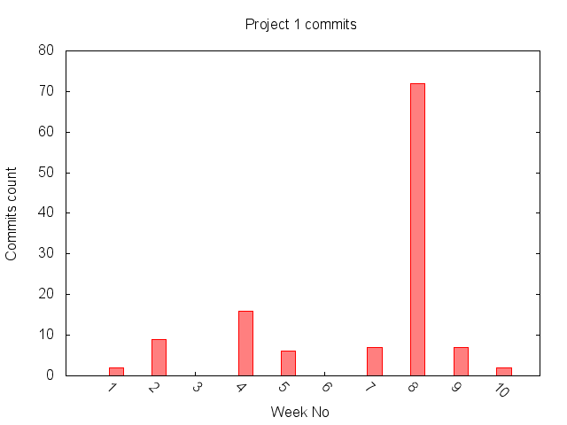

## Repositories we explored
1. bighero4/MarkParser
2. SuperCh-SE-NCSU/ProjectScraping
3. CSC510/SQLvsNOSQL

## Features & Bad smells(Extractor & Results) 

**1. Uneven Commit History**

- __Feature Detection__
    
    In this feature extractor we aim to find anamolous behaviour or irregular commits on week by week basis. We would analyse the number of commits per week. The code for data collection can be found here [scraper.rb](features/uneven_commits/scraper.rb)

- __Feature detection results__
    
    Inorder to create the above feature we need the commit 'sha' and the 'timestamp' attributes. We have used [commits](https://developer.github.com/v3/repos/commits/) API endpoint to gather this data.

    Sample data table: 

    | Commit Sha |date|  
    |----------- |----|
    |0734a1482f009b4c6c8dbe16e34daf3c75567373|2015-04-15 21:40:03 UTC|
    |b71398d37c208a57e006753bcd6fd7ccee89357a|2015-04-15 20:25:37 UTC|

    The links to the entire data set for this extractor can be found here
    * [Project 1](features/uneven_commits/feature_results/project_1_commits.csv)
    * [Project 2](features/uneven_commits/feature_results/project_2_commits.csv)
    * [Project 3](features/uneven_commits/feature_results/project_3_commits.csv)

- __Bad smells detector__
    
    We are analysing the number of commits per week. if any week has number of commits more/less than 2 standard deviation from the mean(of commits) we would consider it as bad smell. This is an indication that work hasn't been distributed evenly and majority of the work was done in 'red flagged week'.
    The bad smell detector can be found here [smell.rb](./features/uneven_commits/smell.rb)

        commits_in_a_week > mean + 2 * standard_deviation 
        OR  commits_in_a_week < mean + 2 * standard_deviation
      
- __Bad smells results__
    
    The graphs for the results are as follows
    
    
    **Mean:** 12.1  
    **Std Dev.:** 20.49 
    **Redflagged week:** 8 with 72 commits __Bad Smell__

    
    **Mean:** 36.42  
    **Std Dev.:** 36.059 
    **Redflagged week:** 13 with 133 commits __Bad Smell__

    
    **Mean:** 18.2   
    **Std Dev.:** 19.06 
    **Redflagged week:** 10 with 62 commits __Bad Smell__
    

